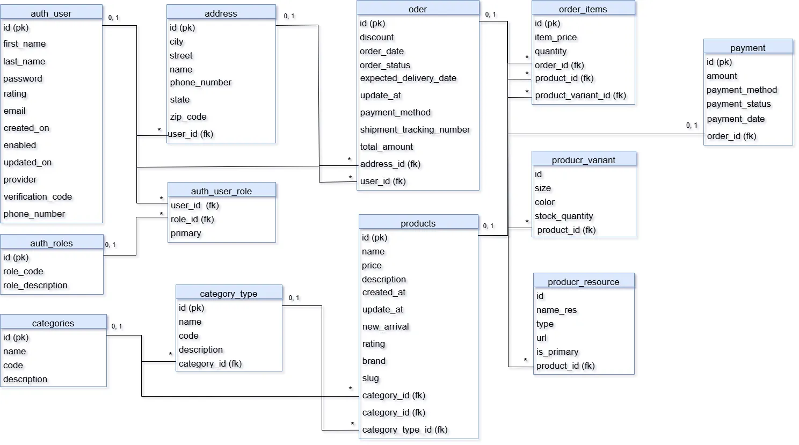

# Drobee Fullstack E-Commerce Project 

Drobee Fullstack E-Commerce Project là ứng dụng **Fullstack** kết hợp **React (Frontend)** và **Spring Boot (Backend)**, được **Docker hóa** để triển khai nhanh chóng, dễ dàng và đồng nhất giữa các môi trường.

---

## Giới thiệu
Dự án đang trong quá trình phát triển với mục tiêu xây dựng một nền tảng thương mại điện tử hoàn chỉnh, mang đến trải nghiệm mua sắm trực tuyến với các tính năng:

- Duyệt & tìm kiếm sản phẩm  
- Quản lý giỏ hàng  
- Quản lý đơn hàng  
- Thanh toán trực tuyến (VNPay, Stripe)  
- Đăng nhập bằng Google  
- Quản trị viên quản lý sản phẩm, đơn hàng, người dùng  

---

## Công nghệ sử dụng

### **Backend (Spring Boot)**
- Java 17+
- Spring Boot (Web, Security, Data JPA, Validation)
- Hibernate ORM
- Spring Security + JWT
- Maven

### **Frontend (React)**
- React 18+ (Vite)
- React Router DOM
- Axios
- TailwindCSS

### **Cơ sở dữ liệu & Cache**
- MySQL 8
- Redis 7

### **Triển khai & DevOps**
- Docker & Docker Compose

---

## ⚙️ Cài đặt & Chạy dự án với Docker

### 1️⃣ Yêu cầu
- [Docker](https://www.docker.com/products/docker-desktop/)  
- [Docker Compose](https://docs.docker.com/compose/)  

---

### 2️⃣ Clone dự án
git clone https://github.com/yuhhz52/drobee_shop.git
cd drobee_shop

---

### 3️⃣ Chạy toàn bộ services
docker compose up -d --build

Backend API: http://localhost:8080
Frontend App: http://localhost:5175

---

4️⃣ Dừng toàn bộ services
docker compose down

---

5️⃣ Cấu trúc thư mục
drobee-ecommerce/
│-- backend/        # Spring Boot API
│-- frontend/       # React frontend
│-- docker-compose.yml
│-- README.md

--- 

Database
